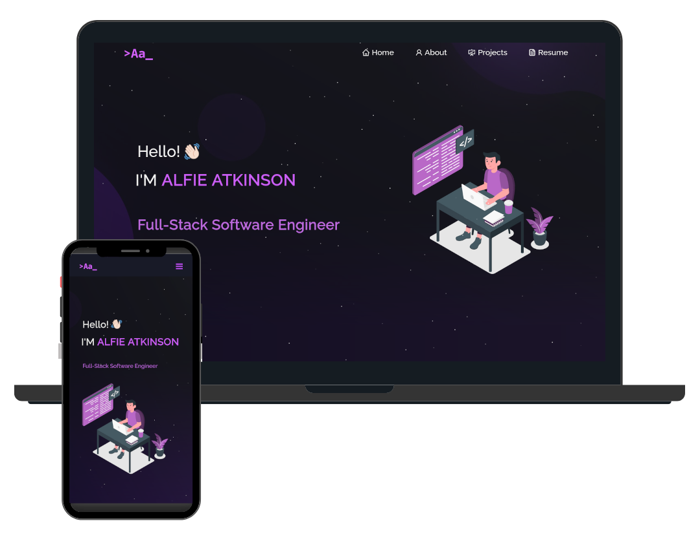

<h2 align="center">
  Portfolio Website 
  <a href="https://old.alfieatkinson.dev" target="_blank">old.alfieatkinson.dev</a>
</h2>

  

<h2 align="center">Build With:</h2>

 

  
  
  
  
  
  
  
  
  
  
  
  
  

 

Adapted from Soumyajit's <a href="https://github.com/soumyajit4419/Portfolio">incredible design</a>.

